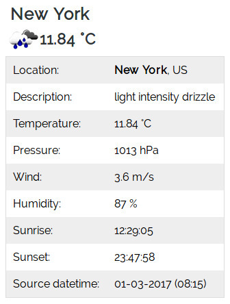
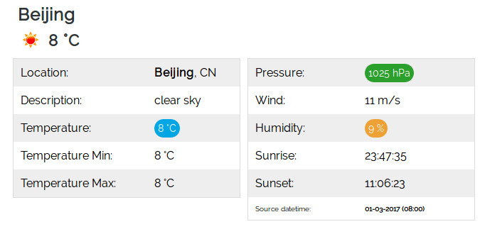
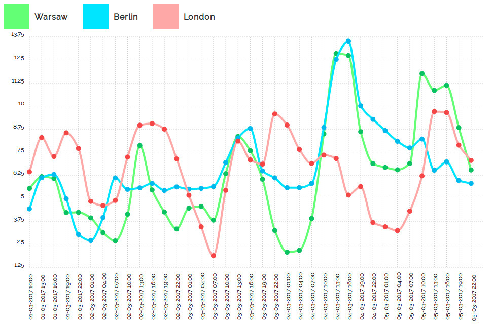
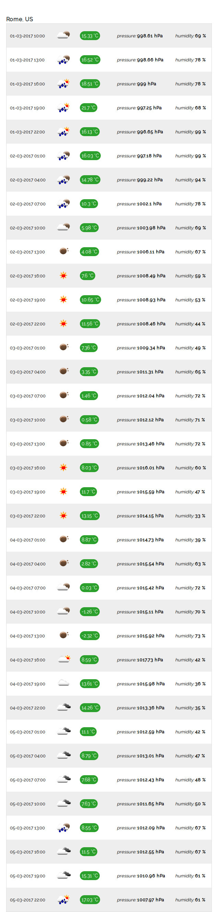

[](https://insight.sensiolabs.com/projects/a32fc8c5-0bc8-4daa-8b8d-eb2696de949c)
======================
[![Software License][ico-license]](LICENSE.md)
[](https://travis-ci.org/dariuszwrzesien/DwrOpenWeatherBundle)
[](https://scrutinizer-ci.com/g/dariuszwrzesien/DwrOpenWeatherBundle/?branch=master)
[](https://coveralls.io/github/dariuszwrzesien/DwrOpenWeatherBundle?branch=master)

# **DwrOpenWeatherBundle**

DwrOpenWeatherBundle is a simply wrapper bundle for [Open Weather API](https://openweathermap.org/).  
In order to start please generate your personal ApiKey first.  
You can do it [here](http://openweathermap.org/appid).

## **Installation**

When you have ApiKey, installation is a quick 3 steps process:

1. Download DwrOpenWeatherBundle using composer
2. Enable the Bundle
3. Add routing to routing.yml in order to can open example in your browser

### Step 1: Download DwrOpenWeatherBundle using composer

Add DwrOpenWeatherBundle in version 2.0 to your composer.json and run 'composer update'

```json
{
    "require": {
        "dwr/openweather-bundle": "2.0"
    }
}
```

or download the bundle by running the command:

``` bash
$ php composer.phar require dwr/openweather-bundle
```

Composer will install the bundle into your project's `vendor/dwr/openweather-bundle` directory.

### Step 2: Enable the bundle and add APIKEY to config.yml

Enable the bundle in the kernel:

``` php
<?php
// app/AppKernel.php

public function registerBundles()
{
    $bundles = array(
        // ...
        new Dwr\OpenWeatherBundle\DwrOpenWeatherBundle(),
    );
}
```

Add **APIKEY** to your config.yml

``` yml
    dwr_open_weather:
        api_key: paste-your-api-key-here
```

### Step 3: Add routing to routing.yml in order to can open example in your browser

``` yml
dwr_open_weather:
    resource: "@DwrOpenWeatherBundle/Controller/"
    type:     annotation
```

Congratulations! You're ready to show weather widget in your symfony application.  
Example how **weather-basic-small** looks like you can find on: yours-application-url/weather-basic-small .

## Usage
### GET Weather

In your Controller

```php
    public function indexAction()
    {
        $openWeather = $this->get('dwr_open_weather');
        $weather = $openWeather->setType('Weather')->getByCityName('London');
        var_dump($weather);
    }
```

You can get weather from OpenWeather API by using:
* getByCityName('London')
* getByCityId('2643743')  
  List of city ID city.list.json.gz can be downloaded [here](http://bulk.openweathermap.org/sample/)
* getByGeographicCoordinates(-0.12574, 51.50853)

### GET Forecast

In your Controller

```php
    public function indexAction()
    {
        $openWeather = $this->get('dwr_open_weather');
        $forecast = $openWeather->setType('Forecast')->getByCityName('London');
        var_dump($forecast);
    }
```

You can get forecast from OpenWeather API by using:
* getByCityName('London')
* getByCityId('2643743')  
  List of city ID city.list.json.gz can be downloaded [here](http://bulk.openweathermap.org/sample/)
* getByGeographicCoordinates(-0.12574, 51.50853)

## Examples

Take a moment and check examples. Maybe you will find there a solution which you like.

In order to run examples on your local:  
1. Add route in your routing.yml (app/config/routing.yml).

```yml
    dwr_open_weather:
        resource: "@DwrOpenWeatherBundle/Controller/"
        type:     annotation
```
- After that, examples should be available in following url addresses:
    - yours-application-url/weather-basic-small
    - yours-application-url/weather-basic-medium
    - yours-application-url/weather-basic-large
    - yours-application-url/forecast-chart
    - yours-application-url/forecast-basic

### How does it exactly look like, you may see below.
### weather-basic-small


Example from: Dwr\OpenWeatherBundle\Controller\DefaultController.php  
Action: weatherBasicSmallAction()

```php
    /**
     * @Route("/weather-basic-small")
     */
    public function weatherBasicSmallAction()
    {
        $openWeather = $this->get('dwr_open_weather');
        $weather = $openWeather->setType('Weather')->getByCityName('London');
        return $this->render('DwrOpenWeatherBundle:Default:weather-basic-small.html.twig', array(
            'weather' => $weather,
        ));
    }
```
### weather-basic-medium


Example from: Dwr\OpenWeatherBundle\Controller\DefaultController.php  
Action: weatherBasicMediumAction()

```php
    /**
     * @Route("/weather-basic-medium")
     */
    public function weatherBasicMediumAction()
    {
        $openWeather = $this->get('dwr_open_weather');
        $weather = $openWeather->setType('Weather')->getByCityName('New York');
        return $this->render('DwrOpenWeatherBundle:Default:weather-basic-medium.html.twig', array(
            'weather' => $weather,
        ));
    }
```
### weather-basic-large


Example from: Dwr\OpenWeatherBundle\Controller\DefaultController.php  
Action: weatherBasicLargeAction()

```php
    /**
     * @Route("/weather-basic-large")
     */
    public function weatherBasicLargeAction()
    {
        $openWeather = $this->get('dwr_open_weather');
        $weather = $openWeather->setType('Weather')->getByCityName('Beijing');
        return $this->render('DwrOpenWeatherBundle:Default:weather-basic-large.html.twig', array(
            'weather' => $weather,
        ));
    }
```
### forecast-chart


Example from: Dwr\OpenWeatherBundle\Controller\DefaultController.php  
Action: forecastChartAction()

```php
    /**
     * @Route("/forecast-chart")
     */
    public function forecastChartAction()
    {
        $openWeather = $this->get('dwr_open_weather');
        
        $city1 = 'Warsaw';
        $forecastCity1 = $openWeather->setType('Forecast')->getByCityName($city1);
        $forecastCity1Labels = json_encode(array_map(function ($value) {
            return Converter::intToDate($value['dt'], 'd-m-Y H:i');
        }, $forecastCity1->lists()));
        $forecastCity1Temps = json_encode(array_map(function ($value) {
            return Converter::kelvinToCelsius($value['main']['temp']);
        }, $forecastCity1->lists()));
        
        $city2 = 'Berlin';
        $forecastCity2 = $openWeather->setType('Forecast')->getByCityName($city2);
        $forecastCity2Labels = json_encode(array_map(function ($value) {
            return Converter::intToDate($value['dt'], 'd-m-Y H:i');
        }, $forecastCity2->lists()));
        $forecastCity2Temps = json_encode(array_map(function ($value) {
            return Converter::kelvinToCelsius($value['main']['temp']);
        }, $forecastCity2->lists()));
        
        $city3 = 'London';
        $forecastCity3 = $openWeather->setType('Forecast')->getByCityName($city3);
        $forecastCity3Labels = json_encode(array_map(function ($value) {
            return Converter::intToDate($value['dt'], 'd-m-Y H:i');
        }, $forecastCity3->lists()));
        $forecastCity3Temps = json_encode(array_map(function ($value) {
            return Converter::kelvinToCelsius($value['main']['temp']);
        }, $forecastCity3->lists()));
        
        return $this->render('DwrOpenWeatherBundle:Default:forecast-chart.html.twig', array(
            'city1' => $city1,
            'forecastCity1' => $forecastCity1,
            'forecastCity1Temps' => $forecastCity1Temps,
            'forecastCity1Labels' => $forecastCity1Labels,
            
            'city2' => $city2,
            'forecastCity2' => $forecastCity2,
            'forecastCity2Temps' => $forecastCity2Temps,
            'forecastCity2Labels' => $forecastCity2Labels,
            
            'city3' => $city3,
            'forecastCity3' => $forecastCity3,
            'forecastCity3Temps' => $forecastCity3Temps,
            'forecastCity3Labels' => $forecastCity3Labels,
        ));
    }
```
### forecast-basic


Example from: Dwr\OpenWeatherBundle\Controller\DefaultController.php  
Action: forecastBasicAction()

```php
    /**
     * @Route("/forecast-basic")
     */
    public function forecastBasicAction()
    {
        $openWeather = $this->get('dwr_open_weather');
        $forecastCity = $openWeather->setType('Forecast')->getByCityName('Rome');
        $forecast = array_map(function ($value) {
            return [
                'timestamp' => $value['dt'],
                'temp' => $value['main']['temp'],
                'pressure' => $value['main']['pressure'],
                'humidity' => $value['main']['humidity'],
                'description' => ($value['weather'][0]['description'])?$value['weather'][0]['description']:'',
                'icon' => ($value['weather'][0]['icon'])?$value['weather'][0]['icon']:'',
            ];
        }, $forecastCity->lists());
        return $this->render('DwrOpenWeatherBundle:Default:forecast-basic.html.twig', array(
            'forecastCity' => $forecastCity,
            'forecast' => $forecast
        ));
    }
```

## License

The MIT License (MIT). Please see [License File](LICENSE.md) for more information.

[ico-license]: https://img.shields.io/badge/license-MIT-brightgreen.svg?style=flat-square
